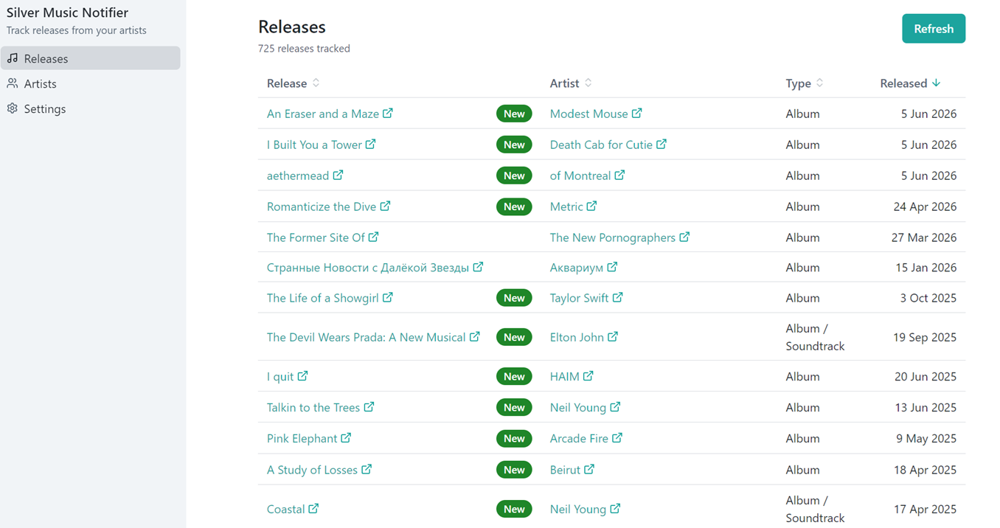

# silver-music-notifier

Track a list of artists and get notified of their new music releases from
[MusicBrainz](https://musicbrainz.org). Drive it from the terminal, or launch a
local web UI (built with [silver-ui](https://silver-ui.com)).



## Install

```bash
npm install -g silver-music-notifier
```

Requires Node.js 22.12.0 or newer.

This requires a working build toolchain for `better-sqlite3` (the native SQLite
driver), which is built automatically on install.

## MusicBrainz contact (required)

MusicBrainz requires every API client to identify a contact (an email or URL) in
its User-Agent, and throttles or blocks requests without one. The first time you
run most CLI commands, the CLI **prompts you for a contact** and saves it.
Non-network setup commands such as `config set`, `clear-data`, and `dismiss`
can run before the contact is configured. You can also set it ahead of time:

```bash
silver-music-notifier config set musicbrainz.contact you@example.com
```

or in the web UI's **Settings** view after the app has launched. In a
non-interactive context (no TTY), commands that require the contact error with
this guidance instead of prompting.

## Usage

### Web UI

```bash
silver-music-notifier web            # starts on http://localhost:3001 and opens a browser
silver-music-notifier web --port 8080 --no-open
```

The UI has three views:

- **Releases** — a feed of every known release-group, newest first, with a
  **Refresh** button and a "New" badge on releases discovered in the last refresh.
- **Artists** — search MusicBrainz and add/remove the artists you follow.
- **Settings** — set the MusicBrainz contact (required), choose notification
  methods, and configure SMTP for email.

### CLI

```bash
silver-music-notifier add "Radiohead"          # search MusicBrainz, pick a match
silver-music-notifier add "Boards of Canada" -y  # add the top match, no prompt
silver-music-notifier add "X" --mbid <mbid>    # add an exact MBID
silver-music-notifier list                     # list tracked artists
silver-music-notifier remove "Radiohead"       # stop tracking (by name or MBID)
silver-music-notifier refresh                  # fetch releases + notify on new ones
silver-music-notifier refresh --no-notify      # fetch without sending email
silver-music-notifier releases --new --limit 20
silver-music-notifier dismiss <release-mbid>   # hide a release's New badge
silver-music-notifier config get               # show settings
silver-music-notifier config set notify.email true
silver-music-notifier clear-data               # delete artists/releases, keep settings
```

## Notifications

When `refresh` finds releases it has never seen before, it can notify you two ways:

- **In-page badges** — "New" badges in the web UI (always available).
- **Email** — one HTML email per new release, sent once SMTP is configured and
  the email toggle is on. Configure it in the **Settings** view or via
  `config set smtp.host`, `smtp.port`, `smtp.secure`, `smtp.user`, `smtp.pass`,
  `smtp.from`, and `smtp.to`.

Adding a new artist refreshes that artist immediately, but treats the existing
catalog as your starting baseline: it does not send email for those releases or
mark them with "New" badges.

`refresh` is manual — run it from the CLI, the web button, or your own scheduler
(cron, systemd timer, etc.).

### Cron refresh

To check for new releases on a schedule, first make sure the CLI has the required
MusicBrainz contact and any notification settings configured:

```bash
silver-music-notifier config set musicbrainz.contact you@example.com
silver-music-notifier config set notify.email true   # optional, if SMTP is configured
```

Then add a cron entry. This example refreshes every day at 9:00 AM:

```cron
0 9 * * * /usr/bin/env silver-music-notifier refresh >> "$HOME/.local/share/silver-music-notifier/cron.log" 2>&1
```

If cron cannot find the command, use the full path from
`command -v silver-music-notifier`. To use a custom database location, set
`SILVER_MUSIC_NOTIFIER_DATA_DIR` in the cron line:

```cron
0 9 * * *
SILVER_MUSIC_NOTIFIER_DATA_DIR="$HOME/.local/share/silver-music-notifier" /usr/bin/env silver-music-notifier refresh >> "$HOME/.local/share/silver-music-notifier/cron.log" 2>&1
```

## Data & configuration

State lives in a single SQLite file (`data.db`) in your per-user data directory:

- **Linux:** `$XDG_DATA_HOME/silver-music-notifier` (usually `~/.local/share/silver-music-notifier`)
- **macOS:** `~/Library/Application Support/silver-music-notifier`
- **Windows:** `%LOCALAPPDATA%\silver-music-notifier\Data`

Override the location with the `SILVER_MUSIC_NOTIFIER_DATA_DIR` environment
variable.

> **Note:** SMTP credentials (including the password) are stored in plaintext in
> that local SQLite file. This is a single-user local tool; treat the data
> directory accordingly.

Notification methods (in-page / email) and the MusicBrainz contact are
configured in the web UI's **Settings** view or via `silver-music-notifier
config set …` — not through environment variables.
